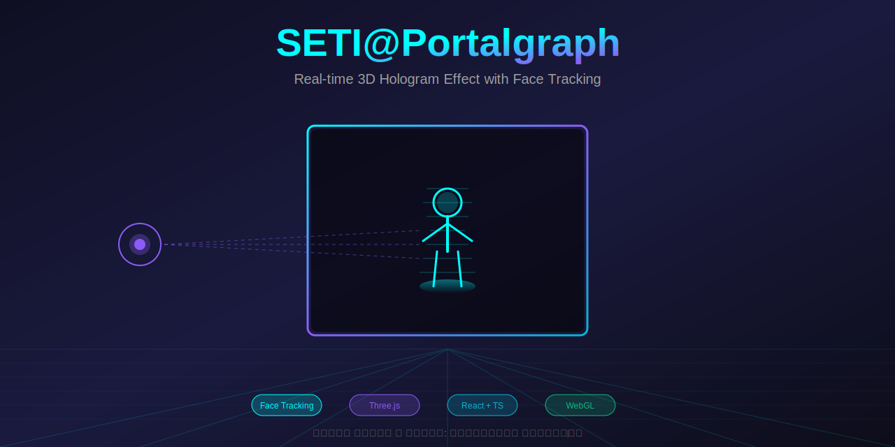
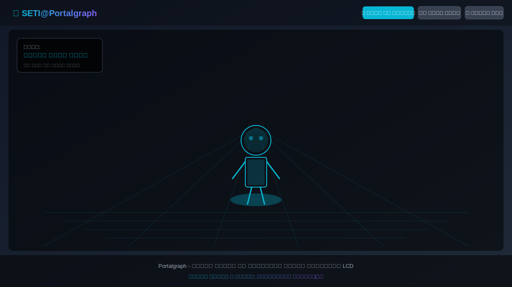
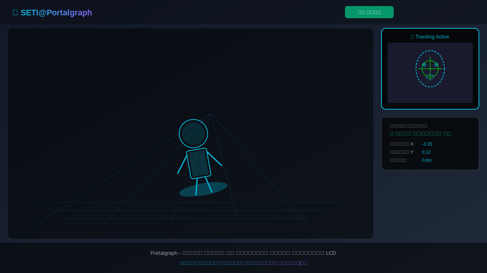
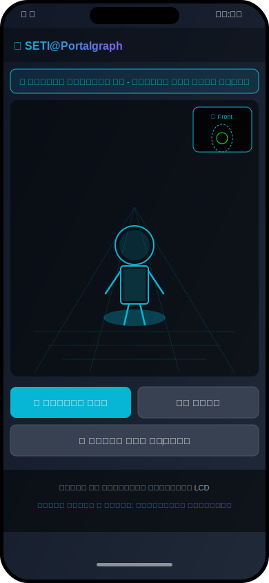
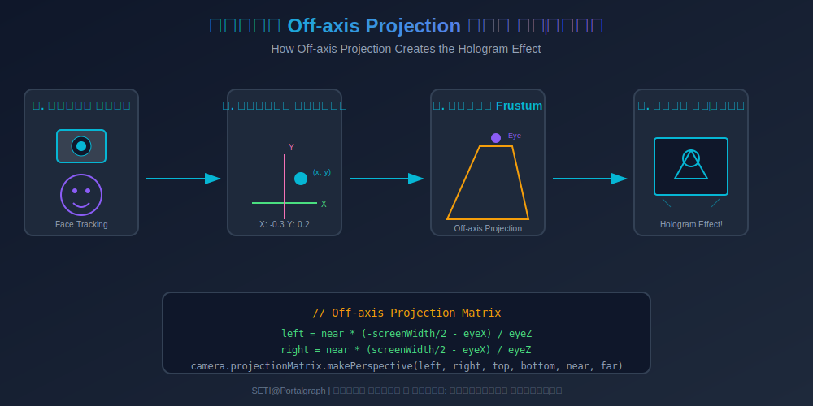

<div align="center">



# 🔮 SETI@Portalgraph

### Real-time 3D Hologram Effect with Face Tracking

[](https://opensource.org/licenses/MIT)
[](https://reactjs.org/)
[](https://threejs.org/)
[](https://www.typescriptlang.org/)
[](https://tailwindcss.com/)

<br/>

[**🚀 تست آنلاین (Live Demo)**](#demo)&nbsp;&nbsp;•&nbsp;&nbsp;[**📖 مستندات**](#documentation)&nbsp;&nbsp;•&nbsp;&nbsp;[**🎬 ویدیو**](#video)

<br/>

> **این پروژه از تکنولوژی واقعی [Portalgraph](https://portalgraph.com) الهام گرفته شده است.**
>
> با استفاده از ردیابی صورت و تکنیک Off-axis Projection، توهم یک هولوگرام سه‌بعدی روی صفحه LCD ایجاد می‌شود.

<br/>

---

<a name="demo"></a>
## 🚀 تست آنلاین

<table>
<tr>
<td align="center">

### برای تست برنامه کلیک کنید:

[](https://your-username.github.io/seti-portalgraph/)

</td>
</tr>
</table>

> ⚠️ برای بهترین تجربه:
> - از مرورگر Chrome یا Firefox استفاده کنید
> - اجازه دسترسی به دوربین را بدهید
> - صفحه را در حالت تمام‌صفحه (F11) ببینید

---

</div>

## 📑 فهرست مطالب

- [درباره پروژه](#-درباره-پروژه)
- [ویژگی‌ها](#-ویژگیها)
- [تصاویر](#-تصاویر)
- [نحوه کارکرد](#-نحوه-کارکرد)
- [نصب و راه‌اندازی](#-نصب-و-راهاندازی)
- [نحوه استفاده](#-نحوه-استفاده)
- [فرمت‌های پشتیبانی شده](#-فرمتهای-پشتیبانی-شده)
- [ساختار پروژه](#-ساختار-پروژه)
- [توسعه](#-توسعه)
- [مشارکت](#-مشارکت)
- [لایسنس](#-لایسنس)

---

## 🎯 درباره پروژه

**SETI@Portalgraph** یک پیاده‌سازی وب از افکت هولوگرام سه‌بعدی است که توسط شرکت Portalgraph معرفی شده. این تکنولوژی با ردیابی موقعیت چشم کاربر و تنظیم پویای پرسپکتیو دوربین، توهم عمق واقعی را روی صفحه‌نمایش معمولی ایجاد می‌کند.

### ایده اصلی:
- 📹 **ردیابی صورت** با دوربین وب
- 🎯 **محاسبه موقعیت چشم** نسبت به صفحه
- 📐 **تنظیم Off-axis Projection** برای ایجاد پرسپکتیو صحیح
- 🖥️ **رندر سه‌بعدی** با زاویه دید متناسب با موقعیت کاربر

---

## ✨ ویژگی‌ها

| ویژگی | توضیحات |
|-------|---------|
| 🎥 **ردیابی صورت** | تشخیص خودکار صورت با دوربین وب |
| 📱 **تشخیص موبایل** | فعال‌سازی خودکار دوربین جلو در موبایل |
| 🖱️ **حالت دستی** | کنترل پرسپکتیو با ماوس/لمس |
| 📁 **آپلود مدل** | پشتیبانی از OBJ, GLB, GLTF |
| 📏 **مقیاس خودکار** | تنظیم اتوماتیک اندازه مدل |
| ⚙️ **کنترل کامل** | چرخش و مقیاس دستی مدل |
| 📱 **ریسپانسیو** | طراحی سازگار با موبایل و دسکتاپ |
| 🌐 **PWA Ready** | قابل نصب به عنوان اپلیکیشن |

---

## 📸 تصاویر

### صفحه اصلی


### ردیابی دوربین


### آپلود مدل سه‌بعدی


### نمای موبایل
<p align="center">
  
</p>

---

## 🔬 نحوه کارکرد



### تکنیک Off-axis Projection

در یک دوربین معمولی، نقطه فرار (vanishing point) در مرکز صفحه است. اما در Off-axis Projection، این نقطه بر اساس موقعیت چشم کاربر جابجا می‌شود:

```typescript
// محاسبه ماتریس پروجکشن نامتقارن
const updateOffAxisProjection = (eyeX: number, eyeY: number, eyeZ: number) => {
  const near = 0.1;
  const far = 1000;
  const screenWidth = 2;
  const screenHeight = 2;
  
  // محاسبه حدود frustum بر اساس موقعیت چشم
  const left = near * (-screenWidth / 2 - eyeX) / eyeZ;
  const right = near * (screenWidth / 2 - eyeX) / eyeZ;
  const top = near * (screenHeight / 2 - eyeY) / eyeZ;
  const bottom = near * (-screenHeight / 2 - eyeY) / eyeZ;
  
  // اعمال ماتریس پروجکشن نامتقارن
  camera.projectionMatrix.makePerspective(left, right, top, bottom, near, far);
};
```

### چرا این کار می‌کند؟

وقتی شما سر خود را حرکت می‌دهید، انتظار دارید زاویه دید به اشیاء تغییر کند. Off-axis projection این تغییر را شبیه‌سازی می‌کند و مغز شما فریب می‌خورد که یک شیء واقعی سه‌بعدی درون یا جلوی صفحه وجود دارد.

---

## 🚀 نصب و راه‌اندازی

### پیش‌نیازها

- Node.js 18.x یا بالاتر
- npm یا yarn

### نصب

```bash
# کلون کردن مخزن
git clone https://github.com/your-username/seti-portalgraph.git
cd seti-portalgraph

# نصب وابستگی‌ها
npm install

# اجرای محیط توسعه
npm run dev

# ساخت نسخه تولید
npm run build
```

### اجرا با Docker

```bash
docker build -t seti-portalgraph .
docker run -p 3000:3000 seti-portalgraph
```

---

## 📖 نحوه استفاده

### ۱. شروع با دوربین
1. روی دکمه **"شروع با دوربین"** کلیک کنید
2. اجازه دسترسی به دوربین را بدهید
3. صورت خود را مقابل دوربین قرار دهید
4. با حرکت سر، پرسپکتیو مدل تغییر می‌کند

### ۲. حالت دستی
1. روی **"حالت دستی"** کلیک کنید
2. با حرکت ماوس یا انگشت، پرسپکتیو را کنترل کنید

### ۳. آپلود مدل سه‌بعدی
1. روی **"آپلود مدل"** کلیک کنید
2. فایل خود را انتخاب یا drag & drop کنید
3. مدل به صورت خودکار مقیاس و مرکز می‌شود
4. از پنل تنظیمات برای چرخش و مقیاس استفاده کنید

---

## 📦 فرمت‌های پشتیبانی شده

| فرمت | پسوند | توضیحات |
|------|-------|---------|
| Wavefront | `.obj` | پشتیبانی کامل از geometry و materials |
| GLTF Binary | `.glb` | فرمت توصیه شده - شامل texture ها |
| GLTF | `.gltf` | JSON format با asset های جداگانه |

### نکات مهم:
- مدل‌های با بیش از 100K polygon ممکن است کند شوند
- Texture های embed شده در GLB بهتر کار می‌کنند
- برای OBJ، فایل MTL باید در همان پوشه باشد

---

## 📁 ساختار پروژه

```
seti-portalgraph/
├── src/
│   ├── components/
│   │   ├── PortalgraphScene.tsx    # صحنه Three.js
│   │   └── ModelUploader.tsx       # آپلود مدل
│   ├── App.tsx                     # کامپوننت اصلی
│   ├── main.tsx                    # نقطه ورود
│   └── index.css                   # استایل‌ها
├── screenshots/                    # تصاویر مستندات
├── public/                         # فایل‌های استاتیک
├── README.md                       # این فایل
├── CONTRIBUTING.md                 # راهنمای مشارکت
├── LICENSE                         # لایسنس MIT
└── package.json                    # وابستگی‌ها
```

---

## 🛠️ توسعه

### اسکریپت‌ها

```bash
npm run dev      # سرور توسعه
npm run build    # ساخت تولید
npm run preview  # پیش‌نمایش build
npm run lint     # بررسی کد
```

### تکنولوژی‌ها

- **React 18** - فریمورک UI
- **Three.js** - موتور سه‌بعدی
- **TypeScript** - تایپ‌سیفتی
- **Tailwind CSS** - استایلینگ
- **Vite** - باندلر

---

## 🤝 مشارکت

از مشارکت شما استقبال می‌کنیم! لطفاً [CONTRIBUTING.md](CONTRIBUTING.md) را مطالعه کنید.

1. Fork کنید
2. Branch بسازید (`git checkout -b feature/amazing-feature`)
3. Commit کنید (`git commit -m 'Add amazing feature'`)
4. Push کنید (`git push origin feature/amazing-feature`)
5. Pull Request بزنید

---

## 📄 لایسنس

این پروژه تحت لایسنس MIT منتشر شده است. برای جزئیات بیشتر فایل [LICENSE](LICENSE) را ببینید.

---

<div align="center">

## 👨‍💻 تیم توسعه

**ایده، طراحی و توسعه**

### امیرسامان پیرایش‌فر

<br/>

---

### ⭐ اگر این پروژه مفید بود، ستاره بدهید!

<br/>

[](https://github.com/your-username/seti-portalgraph)

<br/>

**Portalgraph - الهام گرفته از تکنولوژی واقعی هولوگرام LCD**

</div>
